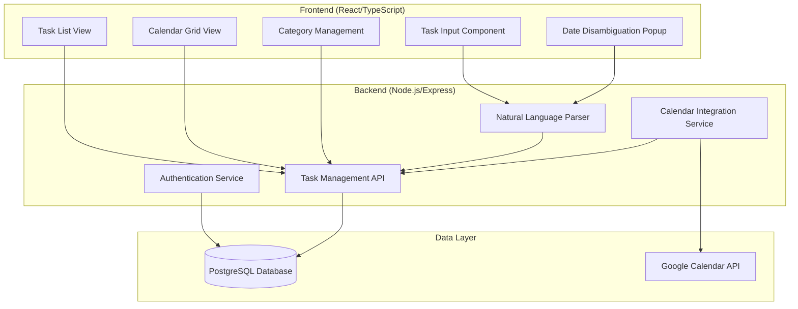

# Taskiro Design Document

## Overview

Taskiro is a personal productivity web application that leverages natural language processing to streamline task creation and management. The application features a dual-view system (task list and calendar grid) with intelligent date parsing, inline editing capabilities, and Google Calendar integration. Built with React/TypeScript frontend, Node.js/Express backend, and PostgreSQL database, Taskiro emphasizes user experience through minimal friction task entry and comprehensive organization features.

## Architecture

### High-Level Architecture



### Technology Stack

- **Frontend**: React 18 with TypeScript, Vite for build tooling
- **Mobile**: Capacitor for native Android app deployment
- **Backend**: Node.js with Express.js framework
- **Database**: PostgreSQL with Prisma ORM
- **Authentication**: JWT-based authentication with bcrypt password hashing
- **Natural Language Processing**: chrono-node library for date parsing
- **Calendar Integration**: Google Calendar API v3
- **Styling**: Tailwind CSS for responsive design
- **State Management**: React Context API with useReducer

## Components and Interfaces

### Frontend Components

#### Core Components

1. **TaskInputComponent**

   - Natural language text input with real-time parsing feedback
   - Manual entry toggle for detailed form
   - Date disambiguation popup integration
   - Priority and category quick-select options

2. **TaskListView**

   - Virtualized list for performance with large task sets
   - Inline editing capabilities for all task properties
   - Filtering and sorting controls (category, priority, status, date)
   - Real-time search functionality by title and description
   - Mobile gestures: tap to complete, swipe to delete with undo option
   - Pull-to-refresh for manual sync trigger
   - Offline mode indicator and sync queue status

3. **CalendarGridView**

   - Traditional monthly calendar layout
   - Task display with priority-based color coding
   - "Show more" button for days with many tasks (>3 tasks)
   - Click-to-edit task details
   - Month navigation with keyboard shortcuts
   - Daily task limit warning at 10 tasks per day

4. **DateDisambiguationPopup**

   - Context-aware date selection for ambiguous inputs
   - "Next week" shows 7-14 days ahead with day names
   - "End of month" shows last 3-5 days of current month
   - Quick selection with keyboard navigation

5. **CategoryManager**

   - CRUD operations for custom categories
   - Default category templates (work, personal, school)
   - Bulk task reassignment on category deletion
   - Category color customization

6. **ThemeProvider**

   - Dark/light mode toggle with system preference detection
   - Theme persistence across sessions
   - Smooth theme transitions

7. **OfflineManager**
   - Offline data caching with IndexedDB
   - Sync queue for pending actions
   - Network status monitoring
   - Automatic sync when connection restored

#### Supporting Components

- **AuthenticationForms**: Login/register with validation
- **TaskCard**: Reusable task display component
- **SearchBar**: Real-time search with highlighted results
- **SyncStatusIndicator**: Shows last sync time and connection status
- **UndoToast**: Temporary undo option for deleted tasks
- **FilterPanel**: Advanced filtering and search
- **ArchiveView**: Historical task browsing
- **SettingsPanel**: User preferences and integrations

### Backend API Interfaces

#### Authentication Endpoints

```typescript
POST / api / auth / register;
POST / api / auth / login;
POST / api / auth / refresh;
DELETE / api / auth / logout;
```

#### Task Management Endpoints

```typescript
GET /api/tasks              // Get all active tasks
POST /api/tasks             // Create new task
PUT /api/tasks/:id          // Update task
DELETE /api/tasks/:id       // Archive task
GET /api/tasks/archived     // Get archived tasks
POST /api/tasks/restore/:id // Restore archived task
```

#### Natural Language Processing

```typescript
POST / api / nlp / parse; // Parse natural language input
POST / api / nlp / disambiguate; // Resolve ambiguous dates
```

#### Category Management

```typescript
GET /api/categories
POST /api/categories
PUT /api/categories/:id
DELETE /api/categories/:id
```

#### Calendar Integration

```typescript
GET / api / calendar / sync; // Sync with Google Calendar
POST / api / calendar / connect; // Connect Google account
DELETE / api / calendar / disconnect;
```

## Data Models

### Database Schema

```sql
-- Users table
CREATE TABLE users (
    id UUID PRIMARY KEY DEFAULT gen_random_uuid(),
    email VARCHAR(255) UNIQUE NOT NULL,
    password_hash VARCHAR(255) NOT NULL,
    created_at TIMESTAMP DEFAULT CURRENT_TIMESTAMP,
    updated_at TIMESTAMP DEFAULT CURRENT_TIMESTAMP
);

-- Categories table
CREATE TABLE categories (
    id UUID PRIMARY KEY DEFAULT gen_random_uuid(),
    user_id UUID REFERENCES users(id) ON DELETE CASCADE,
    name VARCHAR(100) NOT NULL,
    color VARCHAR(7) DEFAULT '#3B82F6',
    is_default BOOLEAN DEFAULT FALSE,
    created_at TIMESTAMP DEFAULT CURRENT_TIMESTAMP
);

-- Tasks table
CREATE TABLE tasks (
    id UUID PRIMARY KEY DEFAULT gen_random_uuid(),
    user_id UUID REFERENCES users(id) ON DELETE CASCADE,
    category_id UUID REFERENCES categories(id) ON DELETE SET NULL,
    title VARCHAR(500) NOT NULL,
    description TEXT,
    due_date DATE,
    due_time TIME,
    priority VARCHAR(10) DEFAULT 'medium' CHECK (priority IN ('low', 'medium', 'high')),
    status VARCHAR(20) DEFAULT 'active' CHECK (status IN ('active', 'completed', 'archived')),
    completed_at TIMESTAMP,
    archived_at TIMESTAMP,
    created_at TIMESTAMP DEFAULT CURRENT_TIMESTAMP,
    updated_at TIMESTAMP DEFAULT CURRENT_TIMESTAMP
);

-- Google Calendar integration
CREATE TABLE calendar_integrations (
    id UUID PRIMARY KEY DEFAULT gen_random_uuid(),
    user_id UUID REFERENCES users(id) ON DELETE CASCADE,
    google_calendar_id VARCHAR(255),
    access_token TEXT,
    refresh_token TEXT,
    token_expires_at TIMESTAMP,
    created_at TIMESTAMP DEFAULT CURRENT_TIMESTAMP
);

-- Indexes for performance
CREATE INDEX idx_tasks_user_id ON tasks(user_id);
CREATE INDEX idx_tasks_due_date ON tasks(due_date);
CREATE INDEX idx_tasks_status ON tasks(status);
CREATE INDEX idx_categories_user_id ON categories(user_id);
```

### TypeScript Interfaces

```typescript
interface User {
  id: string;
  email: string;
  createdAt: Date;
  updatedAt: Date;
}

interface Category {
  id: string;
  userId: string;
  name: string;
  color: string;
  isDefault: boolean;
  createdAt: Date;
}

interface Task {
  id: string;
  userId: string;
  categoryId?: string;
  title: string;
  description?: string;
  dueDate?: Date;
  dueTime?: string;
  priority: "low" | "medium" | "high";
  status: "active" | "completed" | "archived";
  completedAt?: Date;
  archivedAt?: Date;
  createdAt: Date;
  updatedAt: Date;
  category?: Category;
}

interface ParsedInput {
  title: string;
  dueDate?: Date;
  dueTime?: string;
  priority?: "low" | "medium" | "high";
  category?: string;
  confidence: number;
  ambiguousElements?: AmbiguousElement[];
}

interface AmbiguousElement {
  type: "date" | "time" | "priority";
  originalText: string;
  suggestions: Suggestion[];
}

interface Suggestion {
  value: string | Date;
  display: string;
  confidence: number;
}
```

## Error Handling

### Frontend Error Handling

1. **Network Errors**: Retry mechanism with exponential backoff
2. **Validation Errors**: Real-time form validation with user-friendly messages
3. **Authentication Errors**: Automatic token refresh and redirect to login
4. **Parsing Errors**: Graceful fallback to manual entry with context preservation

### Backend Error Handling

1. **Database Errors**: Connection pooling with automatic reconnection
2. **Authentication Errors**: Standardized JWT error responses
3. **Validation Errors**: Comprehensive input sanitization and validation
4. **External API Errors**: Circuit breaker pattern for Google Calendar API
5. **Rate Limiting**: Request throttling with informative error messages

### Offline & Sync Error Handling

1. **Network Failures**:

   - Cache data locally with IndexedDB
   - Queue actions for later sync
   - Show offline mode indicator
   - Automatic retry with exponential backoff

2. **Google Calendar Integration**:

   - Automatic token refresh using refresh tokens
   - Graceful degradation when sync fails
   - Manual reconnection option for users
   - Sync status indicator with last successful sync time
   - User-triggered sync with pull-to-refresh

3. **Sync Conflicts**:
   - Last-write-wins strategy for task updates
   - Conflict resolution UI for simultaneous edits
   - Backup conflicted data for user review

### Error Response Format

```typescript
interface ErrorResponse {
  error: {
    code: string;
    message: string;
    details?: any;
    timestamp: string;
  };
}
```

## Testing Strategy

### Unit Testing

- **Frontend**: Jest + React Testing Library for component testing
- **Backend**: Jest + Supertest for API endpoint testing
- **Database**: In-memory PostgreSQL for isolated testing
- **Natural Language Parser**: Comprehensive test cases for date parsing scenarios

### Integration Testing

- **API Integration**: Full request/response cycle testing
- **Database Integration**: Real database operations with test data
- **Google Calendar Integration**: Mock API responses for reliable testing

### End-to-End Testing

- **User Workflows**: Cypress tests for critical user journeys
- **Cross-browser Testing**: Automated testing on Chrome, Firefox, Safari
- **Mobile Responsiveness**: Viewport testing for mobile devices

### Performance Testing

- **Load Testing**: Simulate concurrent users with Artillery
- **Database Performance**: Query optimization and indexing validation
- **Frontend Performance**: Bundle size analysis and rendering performance

## Security Considerations

### Authentication & Authorization

- JWT tokens with short expiration times (15 minutes)
- Refresh token rotation for enhanced security
- Password hashing with bcrypt (12 rounds minimum)
- Rate limiting on authentication endpoints

### Data Protection

- Input sanitization to prevent XSS attacks
- SQL injection prevention through parameterized queries
- CORS configuration for allowed origins
- HTTPS enforcement in production

### Privacy

- User data isolation through proper database constraints
- Google Calendar permissions limited to read/write calendar events
- No storage of sensitive Google credentials beyond necessary tokens
- Data retention policies for archived tasks

## Performance Optimization

### Frontend Optimization

- Code splitting by route and feature
- Lazy loading of non-critical components
- Virtual scrolling for large task lists
- Debounced search and filtering
- Optimistic UI updates for better perceived performance

### Backend Optimization

- Database connection pooling
- Query optimization with proper indexing
- Caching frequently accessed data (Redis for production)
- Pagination for large data sets
- Background job processing for calendar sync

### Database Optimization

- Composite indexes for common query patterns
- Partitioning for large task tables (future consideration)
- Regular VACUUM and ANALYZE operations
- Connection pooling with pgBouncer

## Deployment Architecture

### Development Environment

- Local PostgreSQL instance
- Hot reloading for frontend and backend
- Environment-specific configuration files
- Docker Compose for consistent development setup
- Capacitor live reload for mobile testing

### Production Environment

#### Web Application

- Containerized deployment with Docker
- PostgreSQL with automated backups
- Load balancing with NGINX
- SSL termination and security headers
- Monitoring with application performance metrics

#### Mobile Application (Android)

- Capacitor build process for native Android APK
- Same backend API endpoints as web application
- Google Play Store deployment pipeline
- Automatic updates through app store

### Cross-Platform Sync

- Shared PostgreSQL database ensures perfect synchronization
- Same REST API endpoints for web and mobile
- JWT authentication works across all platforms
- Real-time updates through WebSocket connections (future enhancement)

### Future Enhancements

- **Desktop Applications**: Electron or Tauri for Windows/macOS/Linux
- **iOS Application**: Capacitor supports iOS with minimal additional work
- **Progressive Web App**: Enhanced offline capabilities and push notifications

### CI/CD Pipeline

- Automated testing on pull requests
- Code quality checks with ESLint and Prettier
- Security scanning for dependencies
- Automated deployment to staging and production
- Database migration management
- Capacitor build automation for mobile releases
